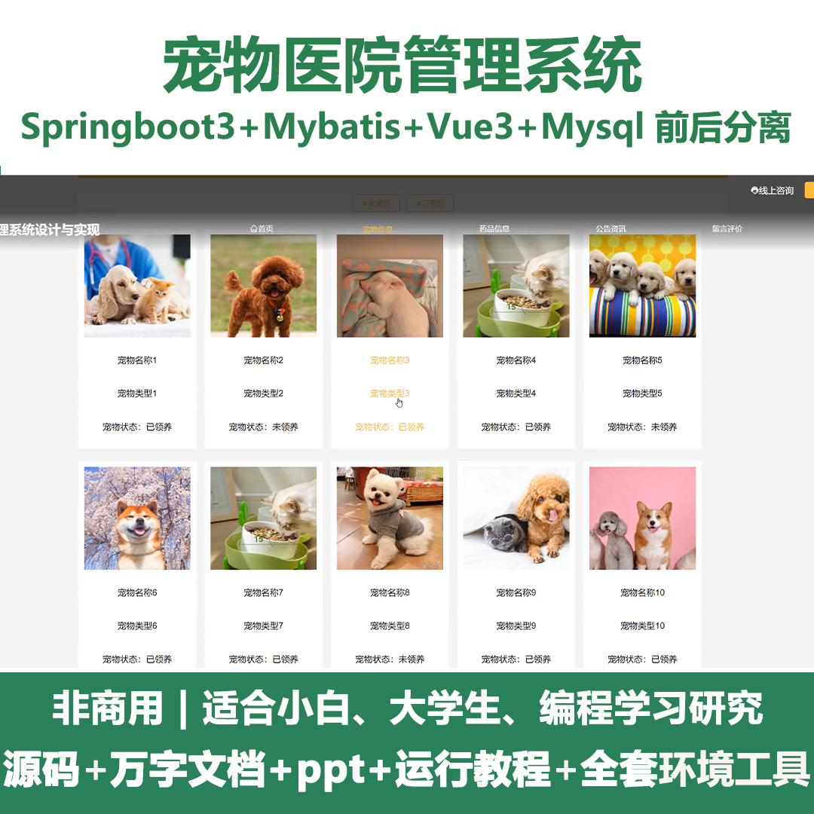
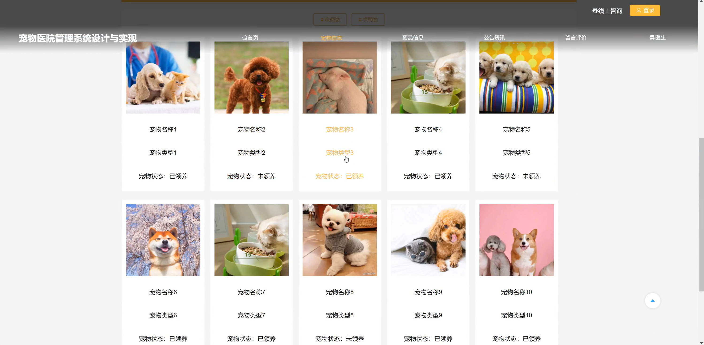
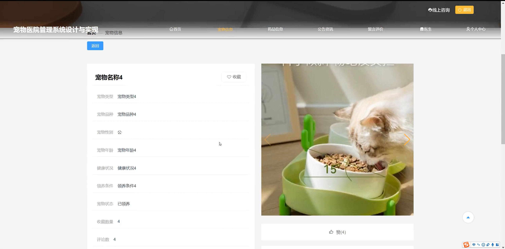
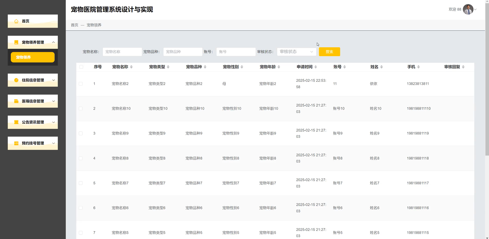
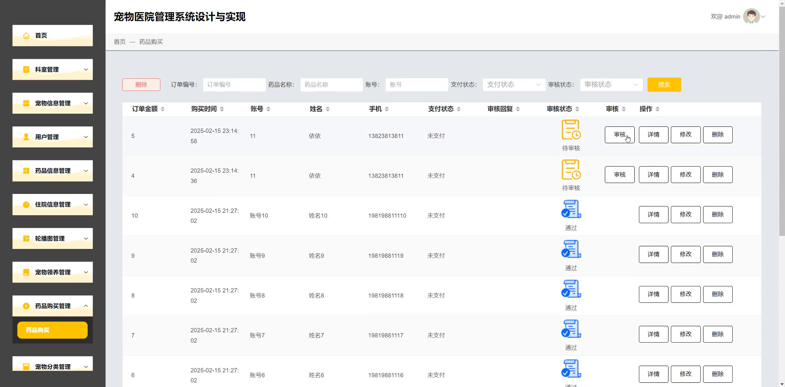
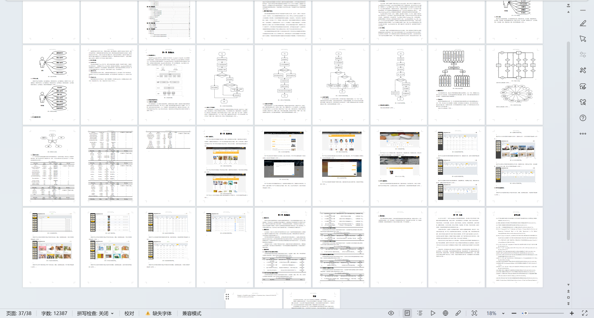

# springbootA439D
springbootA439D宠物医院管理系统+LW+PPT
 
## 查看主页获取源码

### 一、关键词
宠物信息管理、宠物领养管理、宠物分类管理

### 二、作品包含
源码+数据库+设计文档万字+ppt+全套环境和工具资源+本地部署教程

### 三、项目技术
前端技术：Html、Css、Js、Vue3.0、Element-plus 
后端技术：Java、SpringBoot3.0、MyBatis

### 四、运行环境（以下版本亲测，其他版本未知，请自测）
开发工具：IDEA/eclipse  + VSCODE

数据库：MySQL5.7（最低要5.7版本）

数据库管理工具：Navicat10以上版本

环境配置软件： JDK17 + Maven3.6.3

前端Nodejs：20

浏览器：谷歌浏览器

### 五、项目介绍
项目编号：springbootA439D

宠物医院管理系统，实现医疗服务管理的信息化、智能化，提升管理效率与服务质量。 

角色：管理员、用户、医生

管理员：首页、科室管理、宠物信息管理、用户管理、药品信息管理、住院信息管理、轮播图管理、宠物领养管理、药品购买管理、宠物分类管理、药品分类管理、线上咨询管理、预约挂号管理、医嘱信息管理、医生管理、公告资讯管理、留言评价管理。

用户：首页、宠物信息、药品信息、公告资讯、留言评价、医生、个人中心、修改密码、住院信息、宠物领养、药品购买、预约挂号、医嘱信息、我的收藏。

医生：首页、宠物领养管理、住院信息管理、医嘱信息管理、公告资讯管理、预约挂号管理。

### 六、运行截图

